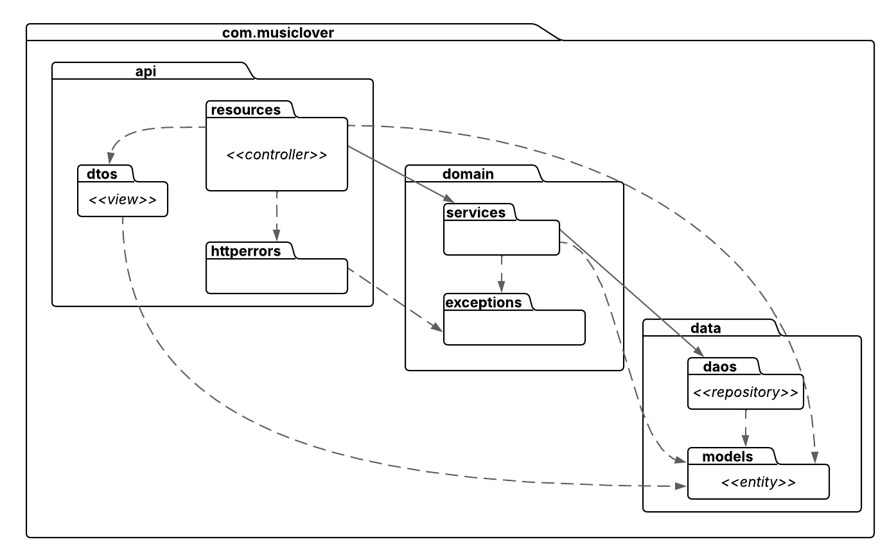

# Music Lover Platform

## Tecnologías usadas
`Spring Framework` `Spring-Boot` `Spring MVC` `Spring Data` `JPA` `Spring Security` `	RESTful API` `JUnit` `Mockito` `Maven` `SQL` `PostgreSQL` `Docker` `SonarQube` `GitHub` `GitHub Actions` `Angular`

## Estado del código
Proyecto | GitHub - CI   
...

## :arrow_forward: Aplicación
...

## :octocat: Repositorios
* [Front-end-angular](https://github.com)
* [Back-end-user](https://github.com)
* [Back-end-core](https://github.com)

## :gear: Instalación del proyecto
...

## 🧠 Descripción funcional del proyecto

**Music Lover Platform** es una plataforma diseñada para ayudar a los amantes de la música clásica a descubrir nuevas obras musicales de acuerdo con sus emociones, preferencias o épocas favoritas. La aplicación permite a los usuarios registrarse, filtrar piezas por criterios específicos (como época, estado de ánimo o instrumento), recibir recomendaciones automáticas personalizadas y guardar sus obras favoritas. Un panel de administración permite la gestión completa del catálogo de piezas.

## [Historias de Usuario](https://youtu.be/FJuq_lrM5Cc?si=lQ7RAZFcuBtKftR9)
| Obtener recomendaciones de obras musicales |
|-----------------------------|
| **Como** *Melómano* queriendo recibir recomendaciones musicales **Puedo** solicitar recomendaciones de piezas musicales según mi estado de  ánimo **Para** descrubir nuevos artistas y/o estilos musicales                |
| **Criterios de aceptación**       |
| **Dado que** quiero descubrir nueva música según mi estado de animo **Cuando** solicite una recomendación **Entonces** obtendré una lista de los distintas piezas musicales con los respectivos detalles                |

| Obtener recomendaciones automáticas |
|-----------------------------|
| **Como** *Melómano* queriendo recibir recomendaciones musicales **Puedo** solicitar una recomendación **Para** descrubir nuevos artistas y/o estilos musicales       |
| **Criterios de aceptación**       |
| **Dado que** quiero descubrir nueva música **Cuando** solicite una recomendación automática **Entonces** obtendré una lista de posibles piezas que sean de mi agrado      |

| Buscar obras musicales por filtros |
|-----------------------------|
| **Como** *Melómano* queriendo encontrar ciertas obras musicales **Puedo** usar un filtro avanzado de búsqueda **Para** encontrar nuevas piezas musicales          |
| **Criterios de aceptación**       |
| **Dado que** quiero buscar obras musicales siguiendo un determinado criterio **Cuando** utilice el filtro avanzado **Entonces** obtendré una lista de todas las piezas musicales que coincidan con el criterio dado      |

| Guardar obras musicales |
|-----------------------------|
| **Como** *Melómano* queriendo guardar mis piezas favoritas **Puedo** marcar cada pieza como favorito **Para** asi guardarlas y no perderlas      |
| **Criterios de aceptación**       |
| **Dado que** quiero guardar mis obras musicales favoritas **Cuando** las marque como favoritas **Entonces** las piezas se guardarán y podré acceder a llas cuando las necesite      |

# :book: Documentación del proyecto
...

## Interfaz de Usuario
* [App Music Lover desplegada en ] (https://github.com)

!image

## Front-end: Angular
### Carpetas
!images

### Seguridad
!images

## Back-end: User
> Spring mediante Arquitectura por Capas

